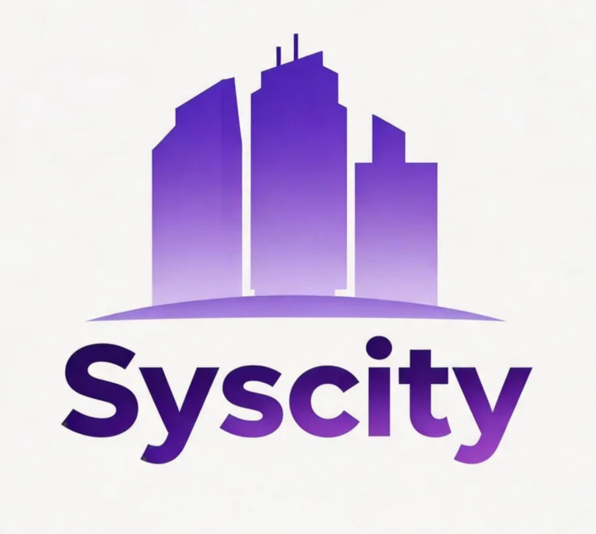

<p align="center">
  
</p>
<h1 align="center">Syscity</h1>
<p align="center"><strong>OS for Physical AI</strong></p>

<p align="center">
  <a href="https://github.com/lightconsen/syscity/actions/workflows/ci.yml">
    
  </a>
  <a href="https://github.com/lightconsen/syscity/blob/main/LICENSE">
    
  </a>
  <a href="https://github.com/lightconsen/syscity#requirements">
    
  </a>
</p>

Syscity is an **os for physical AI** — a runtime that lets AI agents perceive and act on your computer. Unlike chatbots that only read and write text, Syscity agents can **see your screen**, **control your desktop**, **execute code**, **operate your browser**, and **manage your files**.

Traditional AI lives inside a browser tab. Syscity lives inside your machine.

## What is Physical AI?

Physical AI means AI agents that interact with the physical world through a computer's sensors and actuators:

| Perception | Action |
|---|---|
| See the screen (screenshots) | Click, type, and send keyboard shortcuts |
| Read the UI tree (accessibility) | Execute AppleScript / system automation |
| Inspect files and processes | Run shell commands and code |
| Browse the web | Control the browser programmatically |
| Monitor system state | Manage services and scheduled tasks |

Syscity provides the **perception layer**, **action layer**, **memory layer**, and **control plane** that turn a language model into a physical agent.

## Architecture

```
┌─────────────────────────────────────────────────────────────┐
│                      Interaction Layer                        │
│  Web UI · Desktop App · CLI · Telegram · Discord · Slack     │
└─────────────────────────────────────────────────────────────┘
                              │
┌─────────────────────────────────────────────────────────────┐
│                      Control Plane (Gateway)                  │
│  Auth · Rate Limiting · WebSocket · ACP Protocol · Webhooks  │
└─────────────────────────────────────────────────────────────┘
                              │
┌─────────────────────────────────────────────────────────────┐
│                      Agent Runtime                            │
│  LLM Routing · Tool Loop · Memory · Agent Teams · MCP        │
└─────────────────────────────────────────────────────────────┘
                              │
┌─────────────────────────────────────────────────────────────┐
│                      Physical Layer                           │
│  Screenshot · Desktop Control · Accessibility · AppleScript  │
│  Shell · File System · Browser · Code Execution · Web Search │
└─────────────────────────────────────────────────────────────┘
```

## Perception

- **Screenshot** — Capture the screen or a specific window so the agent can "see"
- **Accessibility Tree** — Read the macOS UI hierarchy (window titles, buttons, text fields)
- **File System** — List, read, write, and search files
- **Process Monitor** — Inspect running processes and system state
- **Browser Inspection** — Read page content, DOM, and execute JavaScript
- **Web Search** — Search the internet for real-time information

## Action

- **Desktop Control** — Click, type, scroll, and send keyboard shortcuts (macOS)
- **AppleScript** — Control macOS applications (Mail, Finder, Calendar, etc.)
- **Shell Commands** — Execute bash/zsh commands in a sandboxed environment
- **Code Execution** — Run Python, JavaScript, or shell scripts safely
- **Browser Automation** — Navigate, click, fill forms, and scrape data
- **File Operations** — Create, edit, move, delete, and patch files

## Cognition

- **Multi-Provider LLM** — OpenAI, Anthropic, DeepSeek, Azure, Ollama, and custom endpoints
- **Agent Teams** — Create hierarchies of agents with roles and delegation
- **Vector Memory** — Long-term semantic memory with conversation history
- **MCP Support** — Model Context Protocol servers for external tool integration
- **WASM Plugins** — Extend capabilities with sandboxed WebAssembly plugins

## Quick Start

### Install

```bash
# macOS / Linux
curl -sSL https://syscity.net/install.sh | bash
```

See [docs/build.md](docs/build.md) to build from source.

### Configure

```bash
# Interactive setup wizard
syscity setup
```

Config is saved to `~/.syscity/syscity.toml`.

### Start

```bash
# Start the daemon (web UI + API + WebSocket)
syscity start

# Or run in the foreground
syscity start --foreground
```

Open `http://127.0.0.1:18080` for the Web UI.

### Physical AI in Action

```bash
# Chat from the terminal
syscity chat --message "Take a screenshot and tell me what's on my screen"

# The agent can:
# - Capture your screen
# - Read the UI tree of frontmost windows
# - Click buttons or type text
# - Execute AppleScript to control apps
# - Run shell commands and return results
```

## macOS Physical Control (Best Experience)

On macOS, Syscity unlocks the full physical AI stack:

| Tool | What it does |
|---|---|
| `macos_screenshot` | Capture full screen, window, or region |
| `macos_accessibility` | Read UI tree of any application |
| `macos_desktop_control` | Click, type, scroll, keyboard shortcuts |
| `applescript` | Control Mail, Calendar, Finder, Music, etc. |

Grant **Screen Recording** and **Accessibility** permissions in System Settings for full capability.

## Configuration

```bash
# Set LLM provider and key
syscity config set providers.openai.api_key=sk-xxxxx
syscity config set model=gpt-4o

# Or use environment variables
export SYSCITY_API_KEY="your-api-key"
export SYSCITY_MODEL="gpt-4o"
```

## Documentation

- [Architecture](docs/arch.md)
- [OS Capability Architecture](docs/os-capability-arch.md)
- [Protocol](docs/protocol.md)
- [Commands](docs/command.md)
- [Channels](docs/modules/channels.md)
- [Providers](docs/modules/providers.md)

## License

Apache-2.0
